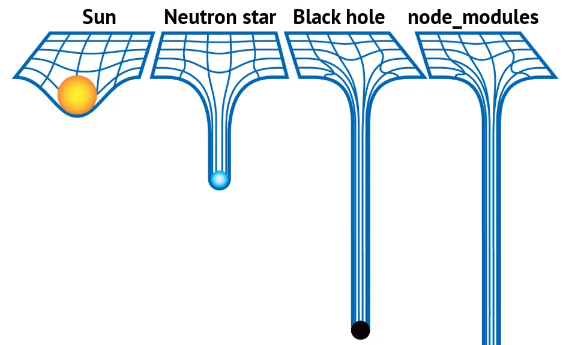

# Package Size

A tool to compare the actual sizes of several npm packages (referring to the size added when installed into `node_modules`).

## Why

As we all know, `node_modules` sucks：

And... You can't know how much space a package will take before you install it (npmjs.com only shows the size of the package itself, not the size of its dependencies). So `bundlephobia` / `packagephobia` / `pkg-size` is born to help you with that.

But... When you have a list of packages to compare, you have to check them one by one. That's why I made this tool.

## Screenshot

<video src="./assets/screenshot.mp4"></video>

## TODO

-   [x] Figma design (https://www.figma.com/design/uUXrkzYipTrj4LY6RWkGK9/Pkg-Size)
-   [x] Backend API
-   [x] Frontend UI
